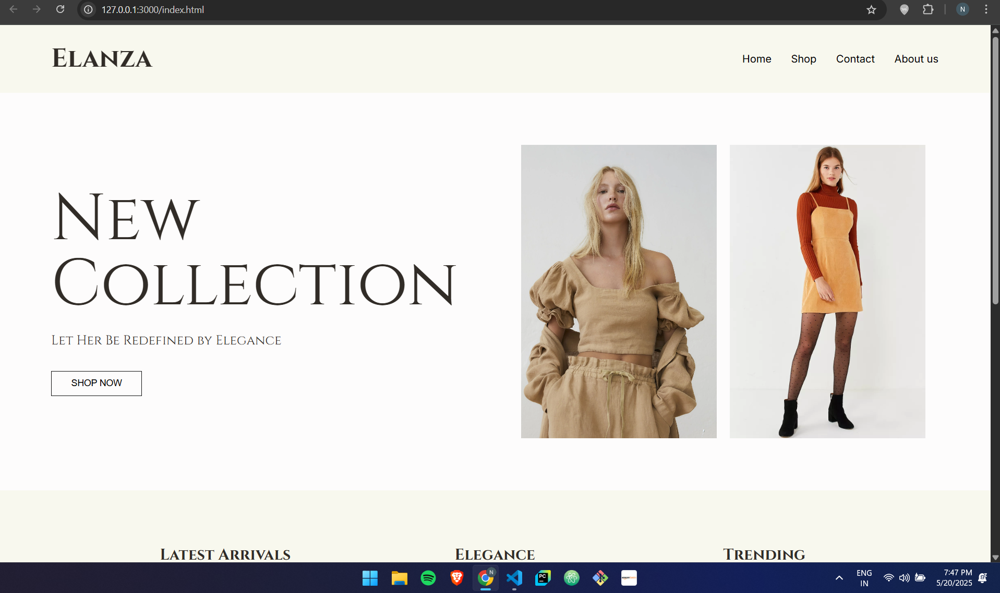

# Elanza 👗

Elanza is a modern and minimalist fashion website built using HTML and CSS. It showcases elegant fashion collections in a clean, responsive layout, designed to reflect simplicity and style.

## 🔧 Technologies Used
- HTML5  
- CSS3  
- Google Fonts (Cinzel, Inter)

## 📸 Preview

## ✨ Features
- Minimalist and elegant design  
- Responsive layout for desktop and mobile  
- Clean typography and layout  
- Hover effects for interactive UI

## 🚀 How to Run
1. Clone the repository  
2. Open `index.html` in your browser  

## 💡 Future Updates
- Add JavaScript interactivity  
- Integrate with backend (e.g., product listings, cart)  
- Host on GitHub Pages or Vercel

### Made with ❤️ by [Nilotpal]

